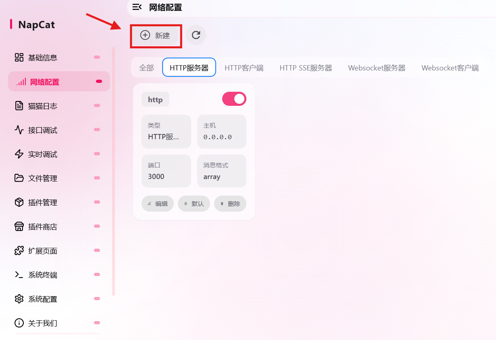
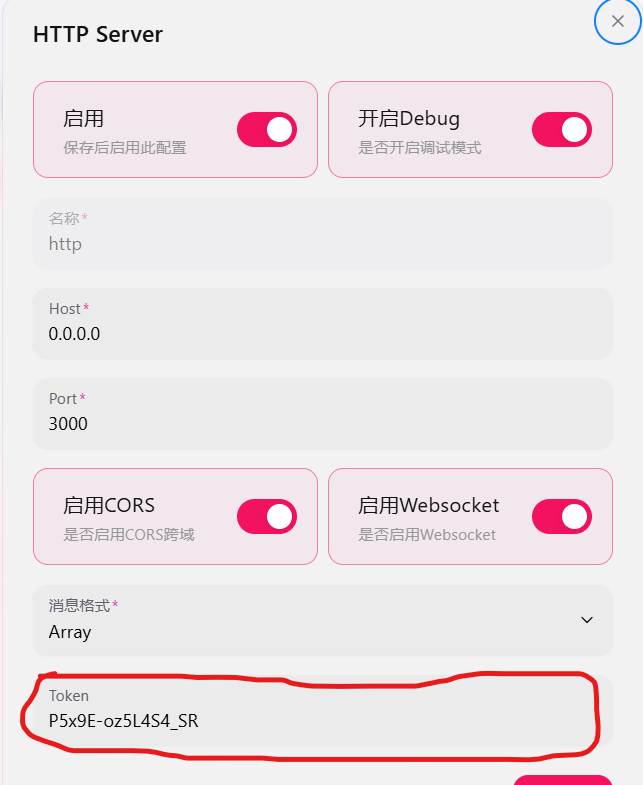
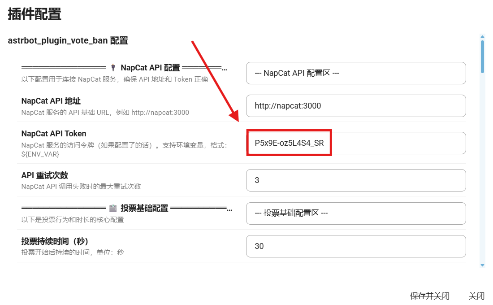

# 投票禁言插件 (astrbot_plugin_vote_ban)

[](https://github.com/whitefox521/astrbot_plugin_vote_ban)
[](https://github.com/AstrBotDevs/AstrBot)
[](LICENSE)

通过群投票让管理员决定是否禁言或踢出群员，支持 **LLM 智能评价**、**百分比/固定票数**、**举报理由输入**。

---

## ✨ 功能特性

- 🗳️ **群投票禁言/踢人**：群成员发起举报，其他成员通过关键词投票决定处理方式。
- 🤖 **LLM 智能评价**：可选用大模型分析被举报者近期发言，生成综合评价供参考。
- 📊 **灵活票数设置**：支持固定票数或按群成员百分比动态计算所需票数。
- 💬 **举报理由输入**（可选）：举报时可要求用户填写理由，增强互动性。
- ⚙️ **可视化配置**：所有参数均可在 AstrBot WebUI 中配置，无需手动编辑 JSON。
- 🖥️ **桌面端兼容**：自动检测 AstrBot 桌面版环境并适配。
## 新增功能

### ⏰ 投票倒计时提醒
- **配置项**：`enable_countdown_reminder`、`countdown_reminder_seconds`（提前秒数）
- **效果**：在投票结束前指定秒数，Bot 会自动发送一条提醒消息，告知剩余时间和当前票数。

### 📢 自定义投票结束语
- **配置项**：`enable_custom_closing_message`、`custom_closing_message`（内容）
- **效果**：投票结束时，除了标准的结果通报，还会额外发送一条自定义消息。

### 📝 投票历史记录
- **自动保存**：每次投票结束后，完整信息会自动保存到 `data/vote_history.json` 文件中。
- **内容包含**：投票ID、群号、发起人、被举报人、理由、票数、是否通过、投票时间、投票成员名单等。

### 🚫 投票黑名单
- **配置项**：`vote_blacklist`（列表）
- **效果**：黑名单内的用户无法发起举报，也无法被他人举报。
---

## 📦 安装

##  环境：用docker容器部署的用户需要注意astrbot与napcat处于同一网络
 
如果不在同一网络，可以用一下命令行，在docker的终端运行即可

第一步：创建共享网络
在终端中执行：
   ```bash
docker network create astrbot-napcat
   ```
第二步：将两个容器接入该网络
   ```bash
docker network connect astrbot-napcat astrbot
docker network connect astrbot-napcat napcat
   ```
注意：请确保你的 AstrBot 容器名确实是 astrbot，如果不同请替换。

第三步：验证连接
   ```bash
docker network inspect astrbot-napcat
   ```
在输出的 JSON 中，找到 "Containers" 部分，应该能看到 astrbot 和 napcat 都在其中，并且有各自的 IP 地址。

### 方式一：插件市场安装(审核还没过，这个方法暂时用不了)
1. 在 AstrBot WebUI 中进入「插件管理」。
2. 点击「添加插件」，搜索 `astrbot_plugin_vote_ban` 并安装。
3. 安装完成后，点击插件卡片上的「配置」进行设置。

### 方式二：手动安装
1. 下载本仓库的压缩包解压到astrbot的目录下

2. 2.具体目录应该就是AstrBot/data/plugins

3. 3.解压好后重启容器就OK了

## 安装好插件后
### 需要在napcat中新建http网络

### 然后按照下图配置，Token是自动生成的，给它复制下来

### 打开插件配置，把复制的Token粘贴在相应位置即可
